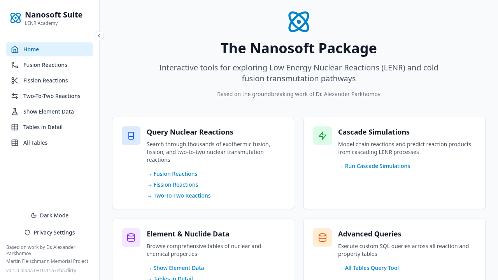
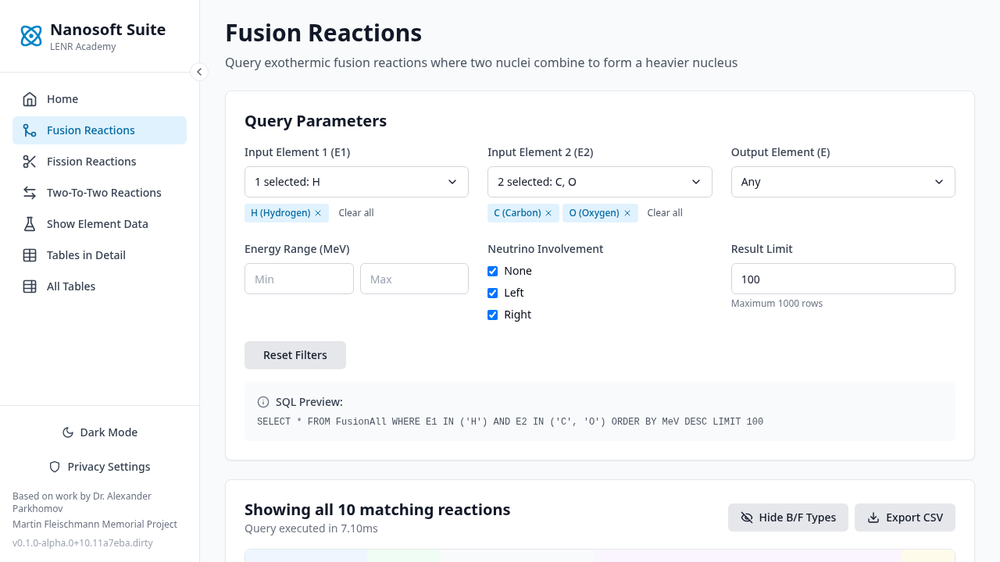
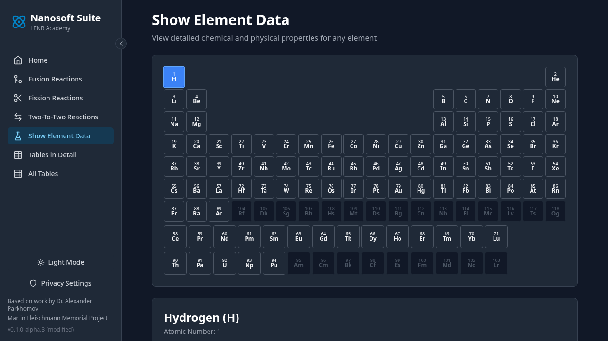
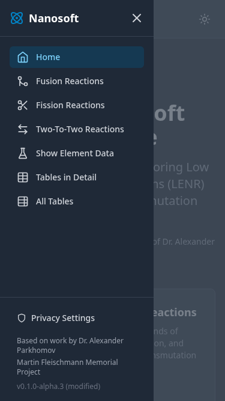
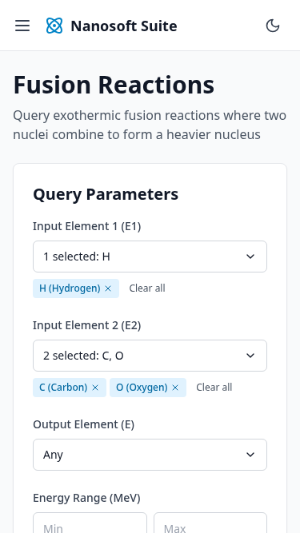

# LENR Academy - Nanosoft Suite

A modern web application for exploring Low Energy Nuclear Reactions (LENR) and cold fusion transmutation pathways. Built on Dr. Alexander Parkhomov's nuclear reaction databases, this tool provides interactive queries and analysis of thermodynamically favorable nuclear transmutations.

**🌐 Live Application**: [lenr.academy](https://lenr.academy)

**📋 GitHub Project**: [Project Board](https://github.com/orgs/Episk-pos/projects/1)

**💬 Community**: [GitHub Discussions](https://github.com/Episk-pos/lenr.academy/discussions)

**📊 Analytics Dashboard**: [Public Usage Statistics](https://cloud.umami.is/share/JGkYeKU60K9D1t4U)

## About

This application provides interactive tools for querying and analyzing a SQLite nuclear reaction database originally compiled by Dr. Alexander Parkhomov. The Parkhomov tables contain:

- **1,389 fusion reactions** - combining lighter nuclei
- **817 fission reactions** - splitting heavier nuclei
- **516,789 two-to-two reactions** - transforming pairs of nuclides

All reactions are exothermic (energy-producing) and represent thermodynamically favorable pathways for nuclear transmutation.

## Features

### Core Query Tools ("Big Three")
- **Fusion Reactions**: Query reactions where two nuclei combine to form a heavier nucleus
- **Fission Reactions**: Query reactions where heavy nuclei split into lighter products
- **Two-To-Two Reactions**: Query 2-2 transmutation reactions

### Supporting Tools
- **Show Element Data**: Interactive periodic table and element property viewer with isotope selection
- **Tables in Detail**: Database schema browser
- **All Tables**: Advanced SQL query builder for custom queries
- **Cascade Simulations**: Model chain reactions and predict reaction products

### Advanced Features
- **Dark/Light Theme**: Toggle between themes with system preference detection
- **Offline SQLite Database Caching**: IndexedDB caching for faster load times and offline access
- **Download Progress**: Real-time progress indicators during database loading
- **Automatic Updates**: Version checking and update notifications
- **Interactive Periodic Table**: Click-to-select elements with visual feedback
- **Nuclide/Isotope Details**: Comprehensive quantum and nuclear properties
- **Element vs Nuclide Views**: Context-aware detail cards on query pages
- **Multi-element Selection**: Query multiple elements simultaneously
- **CSV Export**: Export query results to spreadsheets
- **Error Tracking**: Privacy-focused error monitoring with Sentry (GDPR-compliant, EU hosting)

## Screenshots

### Desktop Views

*Home page with feature overview*

*Fusion Reactions query interface*

*Show Element Data with interactive periodic table (dark mode)*

### Mobile Views

  
  
  

*Mobile views: Navigation sidebar (dark mode), Fusion Reactions query, and Show Element Data*

> 📸 **Screenshots are auto-generated** using Playwright. To regenerate: `npm run screenshots`

## Database

The application uses a **161MB SQLite database** (`parkhomov.db`) containing all nuclear reaction data. The database is:

- **Format**: SQLite 3.x
- **Size**: 161 MB (uncompressed)
- **Tables**: NuclidesPlus, ElementPropertiesPlus, FusionReactions, FissionReactions, TwoToTwoReactions
- **Hosted**: [db.lenr.academy](https://db.lenr.academy/) - versioned storage with S3
- **Download**: Available in [GitHub release assets](https://github.com/Episk-pos/lenr.academy/releases/latest) for offline use or external analysis

The database runs entirely client-side in your browser using [sql.js](https://sql.js.org/) (SQLite compiled to WebAssembly). It's automatically cached in IndexedDB for faster subsequent loads.

### Database Versions

All database versions are available at **[db.lenr.academy](https://db.lenr.academy/)** with:
- Human-readable version browser
- API access at [versions.json](https://db.lenr.academy/versions.json)
- Direct downloads of any version
- MD5 checksums for verification

## Data Sources

Based on the groundbreaking work of:
- **Dr. Alexander Parkhomov** - Original Parkhomov tables (2018)
- **Martin Fleischmann Memorial Project** - Data compilation and research
- **R.W. Greenyer and P.W. Power** - Original [Nanosoft Package](https://nanosoft.co.nz) (PHP application)

## Credits & Attribution

This is a modern reimplementation of the original **Nanosoft Package** PHP web application developed by **R.W. Greenyer** and **P.W. Power**. We are grateful for their pioneering work in making LENR research accessible to the scientific community.

**Original Application**: [nanosoft.co.nz](https://nanosoft.co.nz)

## For Developers

Interested in contributing or running locally?

- 📖 **[Contributing Guide](CONTRIBUTING.md)** - How to contribute, setup instructions, development workflow
- 🛠️ **[Developer Documentation](docs/DEVELOPMENT.md)** - Architecture, technology stack, deployment guides
- 💬 **[GitHub Discussions](https://github.com/Episk-pos/lenr.academy/discussions)** - Ask questions and share ideas

## Development Roadmap

Active development is tracked on our [Project Board](https://github.com/orgs/Episk-pos/projects/1). See [GitHub Issues](https://github.com/Episk-pos/lenr.academy/issues) and [Milestones](https://github.com/Episk-pos/lenr.academy/milestones) for detailed planning.

## License

This project is licensed under the **GNU Affero General Public License v3.0 (AGPL-3.0)** - see the [LICENSE.md](LICENSE.md) file for details.

This is an open science project. All data and code are publicly available to advance LENR research.
