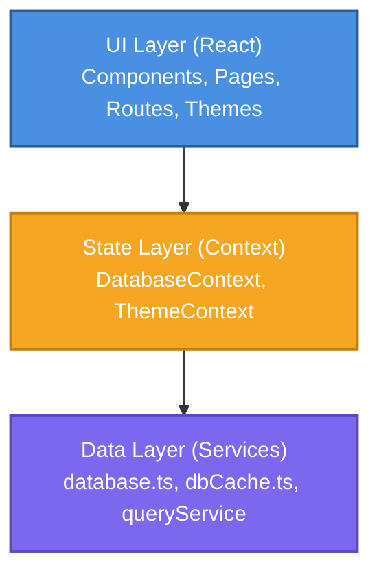
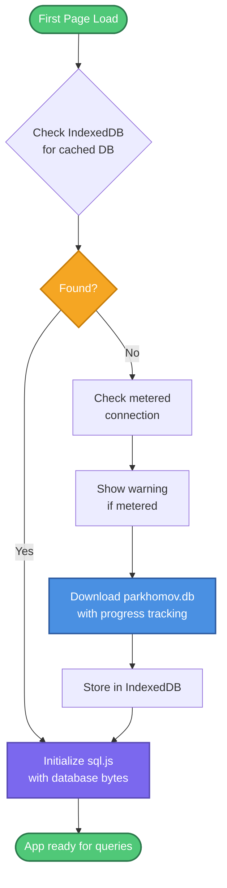

# Developer Documentation

Technical documentation for LENR Academy developers and contributors.

## Table of Contents

- [Architecture Overview](#architecture-overview)
- [Technology Stack](#technology-stack)
- [Project Structure](#project-structure)
- [Database Architecture](#database-architecture)
- [State Management](#state-management)
- [Deployment](#deployment)

## Architecture Overview

LENR Academy uses a **three-layer architecture** designed for client-side operation with a large SQLite database.

### Three-Layer Architecture



#### 1. Data Layer (`src/services/`)

- **`database.ts`**: sql.js initialization with streaming download and progress tracking
- **`dbCache.ts`**: IndexedDB caching with version management and persistent storage
- **`queryService.ts`**: SQL query builders for fusion, fission, two-to-two, and nuclide queries

#### 2. State Layer (`src/contexts/`)

- **`DatabaseContext.tsx`**: Global database state with metered connection detection
- **`ThemeContext.tsx`**: Dark/light theme with localStorage persistence

#### 3. UI Layer (`src/components/` and `src/pages/`)

- **Query pages**: FusionQuery, FissionQuery, TwoToTwoQuery
- **Data viewers**: ShowElementData, TablesInDetail, AllTables
- **Shared components**: PeriodicTable, PeriodicTableSelector, ElementDetailsCard, NuclideDetailsCard

## Technology Stack

### Core Technologies

| Technology | Version | Purpose |
|------------|---------|---------|
| **React** | 18.3 | UI framework |
| **TypeScript** | 5.5+ | Type-safe JavaScript |
| **Vite** | 5.4+ | Build tool and dev server |
| **TailwindCSS** | 3.4+ | Utility-first CSS |
| **React Router** | 6.26+ | Client-side routing |

### Database & Storage

| Technology | Version | Purpose |
|------------|---------|---------|
| **sql.js** | 1.11+ | SQLite compiled to WebAssembly |
| **IndexedDB** | Native | Browser database caching |

### Error Tracking & Monitoring

| Technology | Version | Purpose |
|------------|---------|---------|
| **Sentry** | 10.19+ | Privacy-focused error tracking (GDPR-compliant, EU hosting) |

### Development Tools

| Tool | Purpose |
|------|---------|
| **ESLint** | Code linting |
| **Playwright** | E2E testing and screenshot automation |
| **TypeScript Compiler** | Type checking |

### Key Dependencies

```json
{
  "react": "^18.3.1",
  "react-router-dom": "^6.26.2",
  "sql.js": "^1.11.0",
  "lucide-react": "^0.445.0"
}
```

## Project Structure

```
lenr.academy/
├── src/
│   ├── components/           # Reusable UI components
│   │   ├── Layout.tsx              # Main app layout with sidebar
│   │   ├── PeriodicTable.tsx       # Standalone periodic table (ShowElementData)
│   │   ├── PeriodicTableSelector.tsx  # Multi-select dropdown with PT
│   │   ├── ElementDetailsCard.tsx  # Element properties display
│   │   ├── NuclideDetailsCard.tsx  # Nuclide/isotope details
│   │   ├── DatabaseLoadingCard.tsx # Download progress UI
│   │   ├── DatabaseUpdateBanner.tsx # Version update notifications
│   │   └── PrivacyBanner.tsx       # Analytics consent banner
│   ├── pages/                # Route pages (one per navigation item)
│   │   ├── Home.tsx                # Landing page
│   │   ├── FusionQuery.tsx         # A + B → C reactions
│   │   ├── FissionQuery.tsx        # A → B + C reactions
│   │   ├── TwoToTwoQuery.tsx       # A + B → C + D reactions
│   │   ├── ShowElementData.tsx     # Periodic table & element viewer
│   │   ├── TablesInDetail.tsx      # Database schema browser
│   │   ├── AllTables.tsx           # Advanced SQL query builder
│   │   └── CascadesAll.tsx         # Cascade simulations
│   ├── services/             # Data layer
│   │   ├── database.ts           # sql.js init with streaming download
│   │   ├── dbCache.ts            # IndexedDB caching + version mgmt
│   │   ├── queryService.ts       # SQL query execution engine
│   │   └── mockData.ts           # Sample data for development
│   ├── contexts/             # React Context providers
│   │   ├── DatabaseContext.tsx     # Global DB state
│   │   └── ThemeContext.tsx        # Theme (dark/light) mgmt
│   ├── types/                # TypeScript type definitions
│   │   └── index.ts                # All app types
│   ├── utils/                # Utility functions
│   │   └── version.ts              # Version parsing utilities
│   ├── App.tsx               # Root component with routing
│   ├── main.tsx              # Application entry point
│   ├── index.css             # Global styles with theme support
│   └── vite-env.d.ts         # Vite environment type definitions
├── public/
│   ├── parkhomov.db              # SQLite database (161MB, gitignored)
│   ├── parkhomov.db.meta.json    # Version metadata for updates
│   └── sql-wasm.wasm             # sql.js WebAssembly binary
├── e2e/                      # Playwright E2E tests
│   ├── tests/                      # Test files
│   │   ├── database.spec.ts        # Database loading tests
│   │   ├── navigation.spec.ts      # Navigation tests
│   │   └── version-display.spec.ts # Version display tests
│   └── fixtures/                   # Test fixtures
├── scripts/
│   ├── generate-screenshots.ts  # Automated screenshot generation
│   ├── rebuild_db.py            # Database rebuild script
│   └── verify_db.py             # Database verification
├── docs/                     # Documentation
│   ├── DEVELOPMENT.md            # This file
│   └── screenshots/              # Auto-generated screenshots
├── .github/
│   └── workflows/                # GitHub Actions CI/CD
└── Configuration files
    ├── vite.config.ts            # Vite configuration
    ├── tailwind.config.js        # TailwindCSS configuration
    ├── tsconfig.json             # TypeScript configuration
    ├── playwright.config.ts      # Playwright configuration
    └── package.json              # npm dependencies and scripts
```

### Component Organization

**Query Pages** follow a consistent pattern:
1. State management (selected elements, filters, results)
2. Database query execution via `queryService`
3. Results display with tables and detail cards
4. CSV export functionality

**Reusable Components**:
- Use TypeScript interfaces for props
- Support dark mode via Tailwind `dark:` classes
- Responsive design with mobile-first approach
- Minimal external dependencies

## Database Architecture

### Overview

The application uses **sql.js** (SQLite compiled to WebAssembly) to run queries entirely in the browser. The 161MB database (`parkhomov.db`) contains Dr. Alexander Parkhomov's nuclear reaction tables.

### Database Lifecycle



### Key Tables

| Table | Rows | Description |
|-------|------|-------------|
| **TwoToTwoAll** | 516,789 | A + B → C + D transmutation reactions (includes neutrino-involved) |
| **NuclidesPlus** | ~3,000 | Nuclide properties (Z, A, binding energy, half-life, boson/fermion flags) |
| **FusionAll** | 1,389 | A + B → C fusion reactions (includes neutrino-involved) |
| **FissionAll** | 817 | A → B + C fission reactions (includes neutrino-involved) |
| **ElementPropertiesPlus** | 118 | Chemical element properties (melting point, density, electronegativity) |

### Column Mappings

The database uses abbreviated column names:

**Element table**:
- `P` → Period
- `G` → Group
- `MolarVol` → MolarVolume
- `Val` → Valence
- `ElectG` → ElectConduct
- `ThermG` → ThermConduct

**Nuclide table**:
- `Z` → Atomic number
- `A` → Mass number
- `BE/A` → Binding energy per nucleon
- `LHL` → Log₁₀ of half-life in years
- `nBorF` → Nuclear boson/fermion (based on A)
- `aBorF` → Atomic boson/fermion (based on A-Z)

### Nuclide Stability

A nuclide is considered "stable" if `LHL > 9` (half-life > 1 billion years).

## State Management

### Context Pattern

LENR Academy uses React Context for global state instead of Redux or other state management libraries.

#### DatabaseContext

**Purpose**: Manage database loading state and provide query access

**State**:
```typescript
interface DatabaseContextType {
  db: Database | null                    // sql.js database instance
  isLoading: boolean                     // Loading state
  progress: number                       // Download progress (0-100)
  error: string | null                   // Error message
  showMeteredWarning: boolean            // Metered connection warning
  acceptMeteredDownload: () => void      // User accepts download
}
```

**Usage**:
```typescript
const { db, isLoading } = useDatabase()

if (!db) return <DatabaseLoadingCard />

const results = queryFusionReactions(db, filters)
```

#### ThemeContext

**Purpose**: Manage dark/light theme preference

**State**:
```typescript
interface ThemeContextType {
  theme: 'light' | 'dark'
  toggleTheme: () => void
}
```

**Persistence**: Theme preference saved to `localStorage` as `'theme'` key

### URL State Management

The `ShowElementData` page uses `useSearchParams` from React Router for deep linking:

```typescript
// URL: /element-data?Z=26&A=56
const [searchParams, setSearchParams] = useSearchParams()

const Z = searchParams.get('Z')  // "26"
const A = searchParams.get('A')  // "56"
```

This enables:
- Shareable URLs for specific elements/isotopes
- Browser back/forward navigation
- Bookmarking specific views

## Deployment

### Production Deployment (AWS S3 + CloudFront)

The application is deployed to AWS S3 with CloudFront CDN.

#### Deployment Scripts

```bash
npm run deploy         # Full deployment (S3 sync + cache invalidation)
npm run deploy:s3      # Sync ./dist to S3 bucket
npm run deploy:uncache   # Invalidate CloudFront cache
```

#### AWS Setup

**S3 Bucket**:
- Bucket name: `lenr.academy`
- Static website hosting enabled
- Public read access (bucket policy)

**CloudFront**:
- Origin: S3 bucket website endpoint
- Custom domain: `lenr.academy`
- SSL certificate via ACM
- Default root object: `index.html`
- Error pages: Redirect 404 → `/index.html` (SPA routing)

#### Build Process

```bash
npm run build
```

Outputs to `./dist/`:
- `index.html` - Entry point
- `assets/` - JS, CSS bundles (hashed filenames)
- `parkhomov.db` - Database file
- `parkhomov.db.meta.json` - Version metadata
- `sql-wasm.wasm` - sql.js binary

#### Environment Variables

Set in `vite.config.ts` via `define`:

```typescript
define: {
  'import.meta.env.VITE_APP_VERSION': JSON.stringify(getVersion()),
  'import.meta.env.VITE_BUILD_TIME': JSON.stringify(getBuildTime()),
}
```

**Version String**: Generated via `git describe --tags --always --dirty`

### Analytics Setup (Umami Cloud)

The application uses **Umami Analytics** (privacy-friendly, GDPR-compliant).

#### Setup Steps

1. **Create Umami Cloud Account**: https://cloud.umami.is (free tier: 100k events/month)

2. **Add Website**:
   - Domain: `lenr.academy`
   - Get Website ID (UUID)

3. **Update `index.html`**:
   ```html
   <script
     defer
     src="https://cloud.umami.is/script.js"
     data-website-id="YOUR-WEBSITE-ID"
   ></script>
   ```

4. **Deploy**: Analytics will start tracking after deployment

**Privacy Features**:
- No cookies
- No personal data collection
- GDPR compliant
- User can opt out via PrivacyBanner

### Error Tracking Setup (Sentry)

The application uses **Sentry** for privacy-focused error monitoring.

#### Setup Steps

See detailed setup guide in **[docs/SENTRY_SETUP.md](SENTRY_SETUP.md)** for complete instructions.

**Quick Summary**:
1. Create Sentry account (EU region)
2. Create React project
3. Add GitHub secrets:
   - `VITE_SENTRY_DSN`
   - `SENTRY_ORG`
   - `SENTRY_PROJECT`
   - `SENTRY_AUTH_TOKEN`

**Privacy Features**:
- No PII sent (`sendDefaultPii: false`)
- URL scrubbing (only safe query params kept)
- EU data hosting (GDPR-compliant)
- Source maps uploaded but not included in bundle
- Development mode disabled (console logging only)

**Developer Guidelines**: See **[.claude/sentry-guidelines.md](../.claude/sentry-guidelines.md)** for coding patterns and best practices.

### Continuous Integration (GitHub Actions)

**Workflow**: `.github/workflows/e2e-main.yml`

Runs on every push to `main`:
1. Install dependencies
2. Build application
3. Start preview server
4. Run Playwright E2E tests
5. Upload test artifacts (traces, screenshots)

---

For contribution guidelines, see [CONTRIBUTING.md](../CONTRIBUTING.md).
